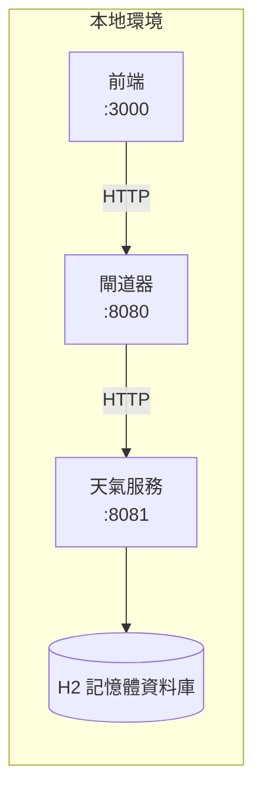
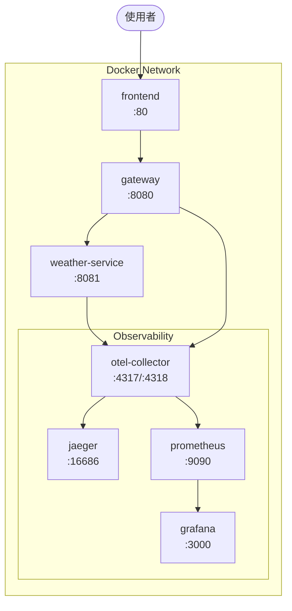
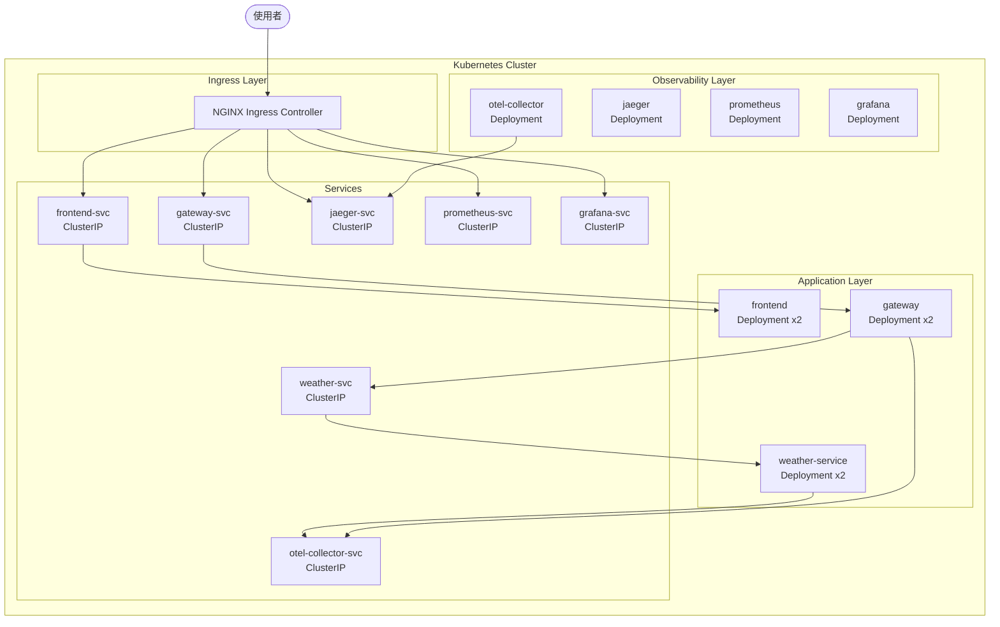
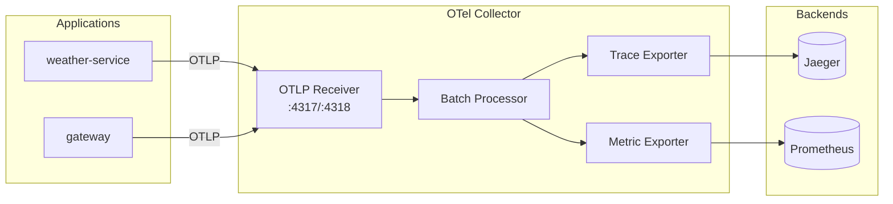

# 部署指南

本文件詳細說明 Weather Tracing PoC 系統的三種部署方式：本地開發環境、Docker 容器化部署、以及 Kubernetes 叢集部署。

## 目錄

- [前置需求](#前置需求)
- [本地開發部署](#本地開發部署)
- [Docker 部署](#docker-部署)
- [Kubernetes 部署](#kubernetes-部署)
- [可觀測性元件](#可觀測性元件)
- [故障排除](#故障排除)

---

## 前置需求

### 基本工具

| 工具 | 版本需求 | 用途 |
|------|----------|------|
| JDK | 17+ | Java 應用程式執行環境 |
| Gradle | 8.5+ | 專案建置工具 |
| Node.js | 18+ | 前端應用程式建置 |
| Docker | 24+ | 容器化部署 |
| kubectl | 1.28+ | Kubernetes 叢集管理 |
| Kustomize | 5.0+ | Kubernetes 配置管理 |

### 檢查工具版本

```bash
# 檢查 Java 版本
java -version

# 檢查 Gradle 版本
./gradlew --version

# 檢查 Node.js 版本
node --version

# 檢查 Docker 版本
docker --version

# 檢查 kubectl 版本
kubectl version --client

# 檢查 Kustomize 版本
kustomize version
```

---

## 本地開發部署

本地開發模式適合開發人員進行功能開發和除錯。

### 架構圖



### 步驟 1：啟動天氣服務

```bash
cd weather-service
./gradlew bootRun
```

服務啟動後可存取：
- API 端點：http://localhost:8081
- Swagger UI：http://localhost:8081/swagger-ui.html
- H2 Console：http://localhost:8081/h2-console
- 健康檢查：http://localhost:8081/actuator/health

### 步驟 2：啟動閘道器

```bash
cd gateway
./gradlew bootRun
```

服務啟動後可存取：
- API 端點：http://localhost:8080
- Swagger UI：http://localhost:8080/swagger-ui.html
- 健康檢查：http://localhost:8080/actuator/health

### 步驟 3：啟動前端

```bash
cd frontend
npm install
npm run dev
```

前端啟動後可存取：http://localhost:3000

### 快速測試

```bash
# 健康檢查
curl http://localhost:8081/actuator/health
curl http://localhost:8080/actuator/health

# 取得天氣資料
curl http://localhost:8080/api/weather/TPE

# 查看追蹤標頭
curl -v http://localhost:8080/api/weather/TPE 2>&1 | grep -i traceparent
```

### H2 資料庫存取

1. 開啟瀏覽器存取：http://localhost:8081/h2-console
2. 連線設定：
   - JDBC URL：`jdbc:h2:mem:weatherdb`
   - 使用者名稱：`sa`
   - 密碼：（空白）

---

## Docker 部署

Docker 部署適合測試環境和簡單的生產環境。

### 架構圖



### 步驟 1：建置 Docker 映像檔

```bash
# 建置天氣服務映像檔
cd weather-service
docker build -t weather-service:latest .

# 建置閘道器映像檔
cd ../gateway
docker build -t gateway:latest .

# 建置前端映像檔
cd ../frontend
docker build -t frontend:latest .
```

### 步驟 2：建立 Docker Compose 檔案

建立 `docker-compose.yml`：

```yaml
version: '3.8'

services:
  # ===== 應用程式服務 =====
  weather-service:
    image: weather-service:latest
    container_name: weather-service
    ports:
      - "8081:8081"
    environment:
      - SPRING_PROFILES_ACTIVE=docker
      - OTEL_EXPORTER_OTLP_ENDPOINT=http://otel-collector:4317
      - OTEL_SERVICE_NAME=weather-service
    depends_on:
      - otel-collector
    networks:
      - weather-network
    healthcheck:
      test: ["CMD", "wget", "--spider", "-q", "http://localhost:8081/actuator/health"]
      interval: 30s
      timeout: 10s
      retries: 3
      start_period: 60s

  gateway:
    image: gateway:latest
    container_name: gateway
    ports:
      - "8080:8080"
    environment:
      - SPRING_PROFILES_ACTIVE=docker
      - OTEL_EXPORTER_OTLP_ENDPOINT=http://otel-collector:4317
      - OTEL_SERVICE_NAME=gateway
      - WEATHER_SERVICE_URL=http://weather-service:8081
    depends_on:
      - weather-service
      - otel-collector
    networks:
      - weather-network
    healthcheck:
      test: ["CMD", "wget", "--spider", "-q", "http://localhost:8080/actuator/health"]
      interval: 30s
      timeout: 10s
      retries: 3
      start_period: 60s

  frontend:
    image: frontend:latest
    container_name: frontend
    ports:
      - "80:80"
    depends_on:
      - gateway
    networks:
      - weather-network

  # ===== 可觀測性服務 =====
  otel-collector:
    image: otel/opentelemetry-collector-contrib:0.96.0
    container_name: otel-collector
    command: ["--config=/etc/otel-collector-config.yaml"]
    volumes:
      - ./otel-collector-config.yaml:/etc/otel-collector-config.yaml
    ports:
      - "4317:4317"   # OTLP gRPC
      - "4318:4318"   # OTLP HTTP
      - "8889:8889"   # Prometheus metrics
    networks:
      - weather-network

  jaeger:
    image: jaegertracing/all-in-one:1.54
    container_name: jaeger
    environment:
      - COLLECTOR_OTLP_ENABLED=true
    ports:
      - "16686:16686" # Jaeger UI
      - "14250:14250" # gRPC
    networks:
      - weather-network

  prometheus:
    image: prom/prometheus:v2.50.1
    container_name: prometheus
    command:
      - '--config.file=/etc/prometheus/prometheus.yml'
      - '--storage.tsdb.path=/prometheus'
      - '--web.enable-lifecycle'
    volumes:
      - ./prometheus.yml:/etc/prometheus/prometheus.yml
      - prometheus-data:/prometheus
    ports:
      - "9090:9090"
    networks:
      - weather-network

  grafana:
    image: grafana/grafana:10.3.3
    container_name: grafana
    environment:
      - GF_SECURITY_ADMIN_USER=admin
      - GF_SECURITY_ADMIN_PASSWORD=admin
    ports:
      - "3000:3000"
    volumes:
      - grafana-data:/var/lib/grafana
    networks:
      - weather-network

networks:
  weather-network:
    driver: bridge

volumes:
  prometheus-data:
  grafana-data:
```

### 步驟 3：建立 OpenTelemetry Collector 配置

建立 `otel-collector-config.yaml`：

```yaml
receivers:
  otlp:
    protocols:
      grpc:
        endpoint: 0.0.0.0:4317
      http:
        endpoint: 0.0.0.0:4318

processors:
  batch:
    timeout: 1s
    send_batch_size: 1024

exporters:
  otlp/jaeger:
    endpoint: jaeger:4317
    tls:
      insecure: true
  prometheus:
    endpoint: 0.0.0.0:8889

service:
  pipelines:
    traces:
      receivers: [otlp]
      processors: [batch]
      exporters: [otlp/jaeger]
    metrics:
      receivers: [otlp]
      processors: [batch]
      exporters: [prometheus]
```

### 步驟 4：建立 Prometheus 配置

建立 `prometheus.yml`：

```yaml
global:
  scrape_interval: 15s
  evaluation_interval: 15s

scrape_configs:
  - job_name: 'otel-collector'
    static_configs:
      - targets: ['otel-collector:8889']

  - job_name: 'weather-service'
    static_configs:
      - targets: ['weather-service:8081']
    metrics_path: '/actuator/prometheus'

  - job_name: 'gateway'
    static_configs:
      - targets: ['gateway:8080']
    metrics_path: '/actuator/prometheus'
```

### 步驟 5：啟動所有服務

```bash
# 啟動所有服務
docker-compose up -d

# 查看服務狀態
docker-compose ps

# 查看日誌
docker-compose logs -f

# 停止所有服務
docker-compose down
```

### Docker 部署端點

| 服務 | URL | 說明 |
|------|-----|------|
| 前端 | http://localhost | Web 介面 |
| 閘道器 API | http://localhost:8080 | API 入口 |
| 天氣服務 | http://localhost:8081 | 天氣 API |
| Jaeger UI | http://localhost:16686 | 追蹤視覺化 |
| Prometheus | http://localhost:9090 | 指標監控 |
| Grafana | http://localhost:3000 | 儀表板 |

---

## Kubernetes 部署

Kubernetes 部署適合生產環境，提供高可用性和自動擴展能力。

### 架構圖



### 前置準備

1. **安裝 NGINX Ingress Controller**

```bash
# 使用 Helm 安裝
helm repo add ingress-nginx https://kubernetes.github.io/ingress-nginx
helm repo update
helm install ingress-nginx ingress-nginx/ingress-nginx \
  --namespace ingress-nginx \
  --create-namespace

# 或使用 kubectl 安裝
kubectl apply -f https://raw.githubusercontent.com/kubernetes/ingress-nginx/controller-v1.9.5/deploy/static/provider/cloud/deploy.yaml
```

2. **設定本地 DNS（開發環境）**

編輯 `/etc/hosts` 檔案：

```bash
# Weather Tracing PoC
127.0.0.1 weather.local
127.0.0.1 jaeger.local
127.0.0.1 grafana.local
127.0.0.1 prometheus.local
```

### 步驟 1：建置並推送映像檔

```bash
# 如果使用本地 Kubernetes（如 Docker Desktop、minikube）
# 可以直接使用本地映像檔

# 建置映像檔
docker build -t weather-service:latest ./weather-service
docker build -t gateway:latest ./gateway
docker build -t frontend:latest ./frontend

# 如果使用遠端叢集，需要推送到 Registry
# docker tag weather-service:latest your-registry/weather-service:latest
# docker push your-registry/weather-service:latest
```

### 步驟 2：使用 Kustomize 部署

```bash
# 預覽部署配置
kubectl kustomize k8s/base

# 部署到叢集
kubectl apply -k k8s/base

# 查看部署狀態
kubectl get all -n weather-tracing
```

### 步驟 3：驗證部署

```bash
# 檢查所有 Pod 是否運行
kubectl get pods -n weather-tracing

# 檢查服務
kubectl get services -n weather-tracing

# 檢查 Ingress
kubectl get ingress -n weather-tracing

# 查看 Pod 日誌
kubectl logs -f deployment/weather-service -n weather-tracing
kubectl logs -f deployment/gateway -n weather-tracing
```

### 步驟 4：存取服務

| 服務 | URL | 說明 |
|------|-----|------|
| 前端 | http://weather.local | Web 介面 |
| API | http://weather.local/api | API 入口 |
| Jaeger | http://jaeger.local | 追蹤視覺化 |
| Prometheus | http://prometheus.local | 指標監控 |
| Grafana | http://grafana.local | 儀表板（admin/admin） |

### Kubernetes 配置說明

#### 資源配額

```yaml
resources:
  requests:
    memory: "256Mi"
    cpu: "250m"
  limits:
    memory: "512Mi"
    cpu: "500m"
```

#### 健康檢查

```yaml
livenessProbe:
  httpGet:
    path: /actuator/health/liveness
    port: 8080
  initialDelaySeconds: 60
  periodSeconds: 10

readinessProbe:
  httpGet:
    path: /actuator/health/readiness
    port: 8080
  initialDelaySeconds: 30
  periodSeconds: 5
```

#### 擴展配置

```bash
# 手動擴展
kubectl scale deployment weather-service --replicas=3 -n weather-tracing

# 自動擴展（需要 Metrics Server）
kubectl autoscale deployment weather-service \
  --min=2 --max=10 --cpu-percent=80 -n weather-tracing
```

### 清理資源

```bash
# 刪除所有資源
kubectl delete -k k8s/base

# 確認已清理
kubectl get all -n weather-tracing
```

---

## 可觀測性元件

### OpenTelemetry Collector

OpenTelemetry Collector 是追蹤資料的收集和轉發中心。



### Jaeger 追蹤查詢

1. 開啟 Jaeger UI
2. 選擇服務（gateway 或 weather-service）
3. 點擊「Find Traces」查看追蹤
4. 點擊單一追蹤查看 Span 詳情

### Prometheus 指標查詢

常用 PromQL 查詢：

```promql
# HTTP 請求總數
http_server_requests_seconds_count

# 請求延遲 P99
histogram_quantile(0.99, rate(http_server_requests_seconds_bucket[5m]))

# 錯誤率
rate(http_server_requests_seconds_count{status=~"5.."}[5m])
```

### Grafana 儀表板設定

1. 登入 Grafana（admin/admin）
2. 新增資料來源：
   - Prometheus：http://prometheus:9090
   - Jaeger：http://jaeger:16686
3. 匯入儀表板或自訂建立

---

## 故障排除

### 常見問題

#### 1. Pod 無法啟動

```bash
# 查看 Pod 狀態
kubectl describe pod <pod-name> -n weather-tracing

# 查看 Pod 日誌
kubectl logs <pod-name> -n weather-tracing --previous
```

#### 2. 服務無法連線

```bash
# 測試服務連通性
kubectl run test-pod --rm -it --image=busybox -n weather-tracing -- sh
# 在 Pod 內執行
wget -qO- http://weather-service:8081/actuator/health
```

#### 3. Ingress 無法存取

```bash
# 檢查 Ingress Controller
kubectl get pods -n ingress-nginx

# 檢查 Ingress 規則
kubectl describe ingress weather-tracing-ingress -n weather-tracing
```

#### 4. 追蹤資料未顯示

```bash
# 檢查 OTel Collector 日誌
kubectl logs deployment/otel-collector -n weather-tracing

# 確認應用程式環境變數
kubectl exec deployment/weather-service -n weather-tracing -- env | grep OTEL
```

### 健康檢查端點

| 服務 | 健康檢查 URL |
|------|--------------|
| weather-service | /actuator/health |
| gateway | /actuator/health |
| otel-collector | :13133/health |
| jaeger | :14269/health |
| prometheus | /-/healthy |
| grafana | /api/health |

### 日誌收集

```bash
# 收集所有 Pod 日誌
kubectl logs -l app.kubernetes.io/part-of=weather-tracing-poc -n weather-tracing --all-containers

# 持續追蹤日誌
kubectl logs -f deployment/gateway -n weather-tracing
```

---

## 附錄：快速指令參考

```bash
# ===== 本地開發 =====
./gradlew bootRun                          # 啟動服務
./gradlew build                            # 建置專案
./gradlew test                             # 執行測試

# ===== Docker =====
docker-compose up -d                       # 啟動所有服務
docker-compose down                        # 停止所有服務
docker-compose logs -f                     # 查看日誌
docker-compose ps                          # 查看狀態

# ===== Kubernetes =====
kubectl apply -k k8s/base                  # 部署
kubectl delete -k k8s/base                 # 清理
kubectl get all -n weather-tracing         # 查看狀態
kubectl logs -f deploy/<name> -n weather-tracing  # 查看日誌
```
