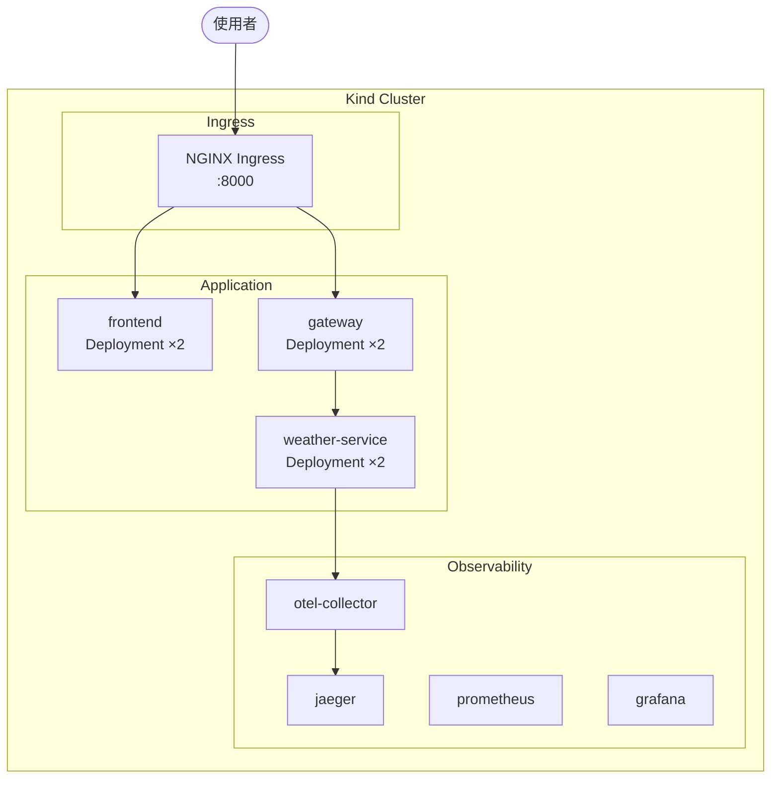
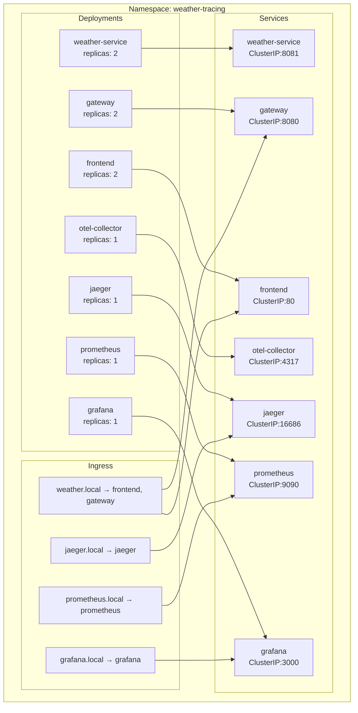
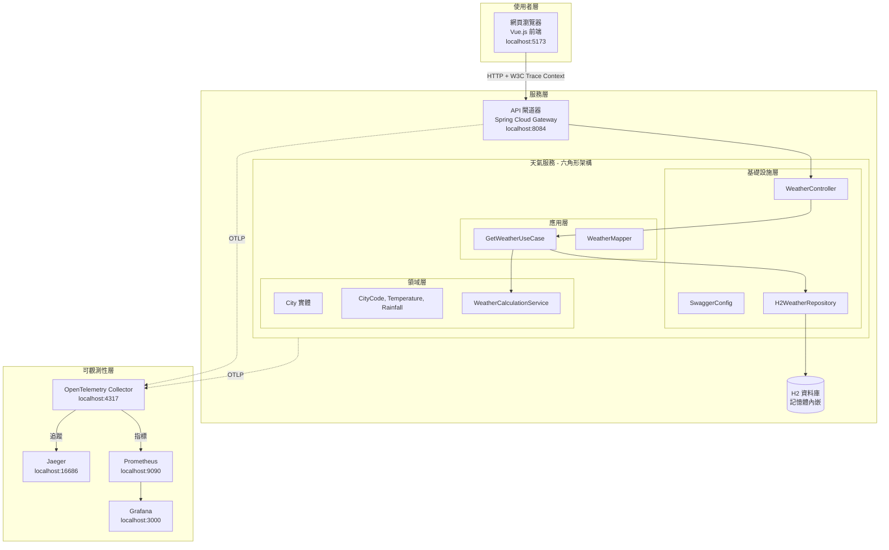
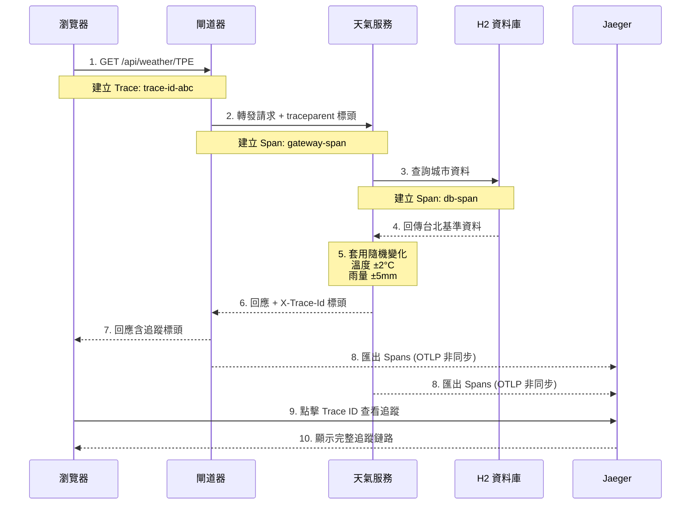
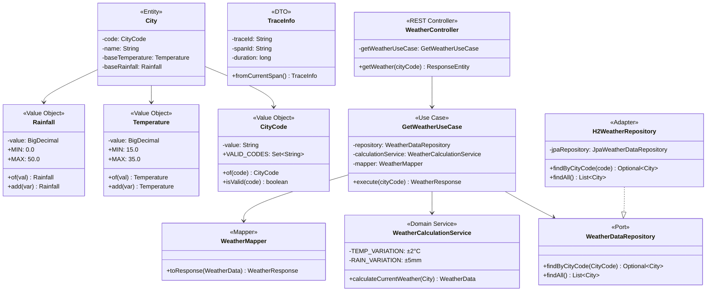
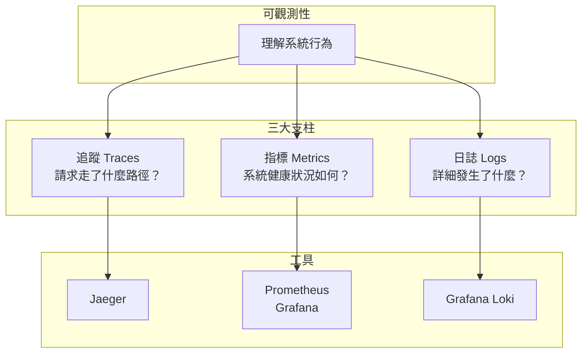
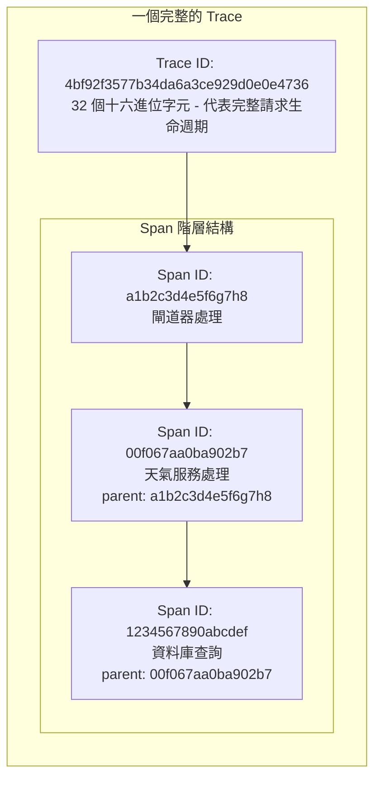
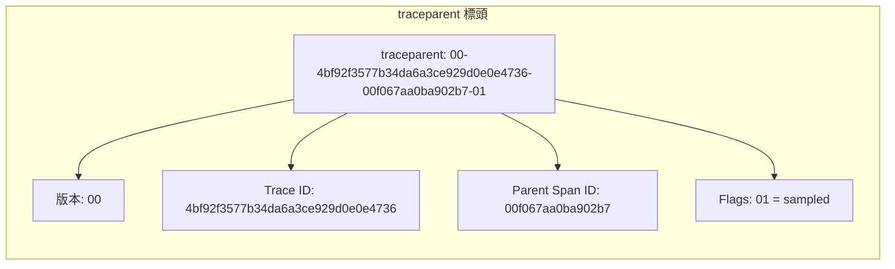
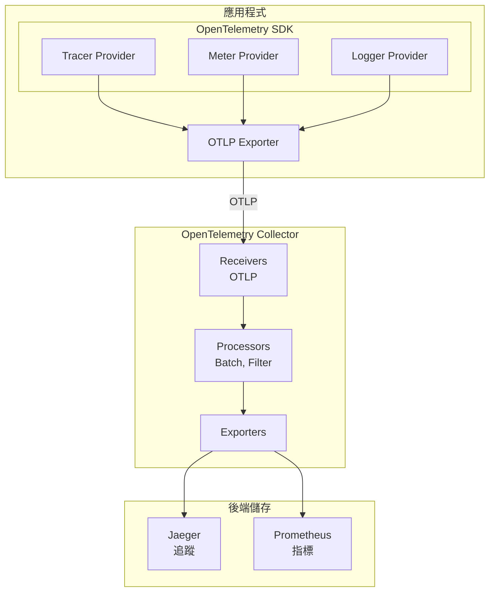

# 天氣查詢可觀測性展示系統

一個完整的分散式追蹤與可觀測性實作範例，透過天氣查詢應用程式展示現代微服務架構的最佳實踐。

> **學習目標**：透過這個專案，您將學習到分散式追蹤、可觀測性三大支柱、Trace ID 與 Span ID 的概念，以及如何整合 OpenTelemetry、Jaeger、Prometheus 和 Grafana。

---

## 目錄

1. [專案概述](#專案概述)
2. [快速開始](#快速開始)
3. [Kubernetes 部署](#kubernetes-部署)
4. [系統架構](#系統架構)
5. [可觀測性深入解析](#可觀測性深入解析)
6. [開發工具](#開發工具)
7. [測試範例](#測試範例)
8. [技術堆疊](#技術堆疊)
9. [專案結構](#專案結構)

---

## 專案概述

本專案透過簡單的天氣查詢系統，展示現代可觀測性實踐：

- **分散式追蹤**：使用 OpenTelemetry 追蹤跨服務請求
- **指標收集**：透過 Prometheus 和 Micrometer 監控系統效能
- **API 文件**：使用 Swagger UI 進行互動式 API 測試
- **儀表板視覺化**：透過 Grafana 進行即時監控

### 主要功能

| 功能 | 說明 |
|------|------|
| 天氣查詢 | 查詢三個城市天氣：台北 (TPE)、台中 (TXG)、高雄 (KHH) |
| 追蹤視覺化 | 透過 Jaeger UI 查看完整請求鏈路 |
| 指標儀表板 | 透過 Grafana 監控系統指標 |
| Swagger UI | 互動式 API 文件與測試 |
| H2 Console | 瀏覽器內資料庫管理介面 |

---

## 快速開始

### 環境需求

- Java 17+
- Node.js 18+
- Docker & Docker Compose
- Gradle 8.x

### 步驟一：複製與建置

```bash
# 複製專案
git clone https://github.com/ChunPingWang/tracing-microservices-poc.git
cd tracing-microservices-poc

# 建置專案
./gradlew build
```

### 步驟二：啟動服務

#### 方式 A：本地開發（適合開發除錯）

**一鍵啟動（推薦）：**

```bash
# 啟動所有服務
./scripts/start-services.sh start

# 檢查狀態
./scripts/start-services.sh status

# 停止所有服務
./scripts/start-services.sh stop
```

**手動啟動（分開終端機）：**

```bash
# 終端機 1：啟動可觀測性堆疊
docker compose -f docker-compose.dev.yml up -d

# 終端機 2：啟動天氣服務
./gradlew :weather-service:bootRun

# 終端機 3：啟動閘道器
./gradlew :gateway:bootRun

# 終端機 4：啟動前端
cd frontend && npm install && npm run dev
```

#### 方式 B：Docker Compose（推薦，一鍵啟動）

```bash
# 啟動所有服務
docker compose up -d

# 檢查狀態
docker compose ps

# 停止服務
docker compose down
```

#### 方式 C：Kubernetes（適合模擬生產環境）

```bash
# 建立 Kind 叢集
./scripts/kind-cluster.sh create
./scripts/kind-cluster.sh ingress

# 完整部署（建置 + 載入 + 部署）
./scripts/k8s-deploy.sh all

# 詳細說明請參考下方「Kubernetes 部署」章節
```

#### 驗證部署：整合測試

服務啟動後，執行整合測試確認系統正常運作：

```bash
# 執行完整整合測試
./scripts/integration-test.sh

# 等待服務就緒後執行
./scripts/integration-test.sh --wait

# 只執行健康檢查
./scripts/integration-test.sh --health-only

# 只執行 API 測試
./scripts/integration-test.sh --api-only

# 快速煙霧測試
./scripts/smoke-test.sh
```

**測試項目：**

| 類別 | 測試項目 | 說明 |
|------|---------|------|
| 健康檢查 | 服務健康狀態 | 驗證所有服務正常運行 |
| API 測試 | 天氣查詢 API | 驗證 TPE/TXG/KHH 查詢 |
| 錯誤處理 | 無效城市代碼 | 驗證錯誤回應 |
| 追蹤測試 | Trace ID 傳遞 | 驗證追蹤標頭存在 |
| 可觀測性 | Jaeger 追蹤 | 驗證追蹤資料匯出 |

### 步驟三：存取服務

| 服務 | 網址 | 說明 |
|------|------|------|
| 前端介面 | http://localhost:5173 | Vue.js 網頁 UI |
| 閘道器 API | http://localhost:8084/api | API 閘道器 |
| 天氣服務 | http://localhost:8083 | 後端服務 |
| **Swagger UI** | http://localhost:8083/swagger-ui.html | API 文件 |
| **H2 Console** | http://localhost:8083/h2-console | 資料庫控制台 |
| Jaeger UI | http://localhost:16686 | 追蹤視覺化 |
| Prometheus | http://localhost:9090 | 指標資料庫 |
| Grafana | http://localhost:3000 | 儀表板 |

---

## Kubernetes 部署

本專案支援使用 Kind (Kubernetes IN Docker) 進行本地 Kubernetes 部署，適合學習和測試。

### 架構概覽



### 前置需求

| 工具 | 安裝指令 (macOS) | 說明 |
|------|-----------------|------|
| Docker | [Docker Desktop](https://www.docker.com/products/docker-desktop/) | 容器執行環境 |
| Kind | `brew install kind` | 本地 K8s 叢集 |
| kubectl | `brew install kubectl` | K8s CLI 工具 |

### 步驟一：建立 Kind 叢集

```bash
# 建立叢集
./scripts/kind-cluster.sh create

# 安裝 NGINX Ingress Controller
./scripts/kind-cluster.sh ingress
```

**叢集管理指令：**

```bash
# 檢查叢集狀態
./scripts/kind-cluster.sh status

# 顯示叢集資訊
./scripts/kind-cluster.sh info

# 刪除叢集
./scripts/kind-cluster.sh delete
```

### 步驟二：建置與載入映像檔

```bash
# 建置 Docker 映像檔
./scripts/k8s-deploy.sh build

# 載入映像檔到 Kind 叢集
./scripts/k8s-deploy.sh load
```

### 步驟三：部署應用程式

```bash
# 部署到 Kubernetes
./scripts/k8s-deploy.sh deploy

# 或一次執行完整流程（build + load + deploy）
./scripts/k8s-deploy.sh all
```

### 步驟四：存取服務

#### 方式 A：設定 /etc/hosts（推薦）

```bash
# 編輯 /etc/hosts，加入以下內容
sudo nano /etc/hosts

# 加入：
127.0.0.1 weather.local jaeger.local grafana.local prometheus.local
```

存取服務：

| 服務 | 網址 | 說明 |
|------|------|------|
| 前端 | http://weather.local:8000 | Web 介面 |
| API | http://weather.local:8000/api | API 端點 |
| Jaeger | http://jaeger.local:8000 | 追蹤 UI |
| Prometheus | http://prometheus.local:8000 | 指標查詢 |
| Grafana | http://grafana.local:8000 | 儀表板 (admin/admin) |

#### 方式 B：使用 Port Forward

```bash
# 前端 (另開終端機)
kubectl port-forward -n weather-tracing svc/frontend 8080:80

# 閘道器 API
kubectl port-forward -n weather-tracing svc/gateway 8081:8080

# Jaeger UI
kubectl port-forward -n weather-tracing svc/jaeger 16686:16686

# Grafana
kubectl port-forward -n weather-tracing svc/grafana 3000:3000
```

### 部署管理指令

```bash
# 檢查部署狀態
./scripts/k8s-deploy.sh status

# 顯示存取資訊
./scripts/k8s-deploy.sh access

# 查看閘道器日誌
./scripts/k8s-deploy.sh logs gateway

# 查看天氣服務日誌
./scripts/k8s-deploy.sh logs weather-service

# 重新部署（重新建置映像檔）
./scripts/k8s-deploy.sh redeploy

# 刪除所有 K8s 資源
./scripts/k8s-deploy.sh undeploy
```

### 測試 Kubernetes 部署

```bash
# 執行快速測試
./scripts/k8s-deploy.sh test

# 手動測試 API（使用 port-forward）
kubectl port-forward -n weather-tracing svc/gateway 8080:8080 &
curl http://localhost:8084/api/weather/TPE | jq
```

### Kubernetes 資源結構



### 故障排除

**叢集建立失敗（Port 衝突）：**

```bash
# 檢查哪個程式佔用 port
lsof -i :80
lsof -i :8000

# 停止佔用 port 的服務或修改 scripts/kind-config.yaml
```

**Pod 無法啟動：**

```bash
# 檢查 Pod 狀態
kubectl get pods -n weather-tracing

# 查看 Pod 詳情
kubectl describe pod <pod-name> -n weather-tracing

# 查看 Pod 日誌
kubectl logs <pod-name> -n weather-tracing
```

**映像檔未找到：**

```bash
# 確認映像檔已建置
docker images | grep -E "weather-service|gateway|frontend"

# 重新載入映像檔到 Kind
./scripts/k8s-deploy.sh load
```

---

## 系統架構

### 系統架構圖



### 請求流程時序圖



### 六角形架構類別圖



---

## 可觀測性深入解析

### 什麼是可觀測性？

可觀測性是指透過系統的外部輸出來理解系統內部狀態的能力。它建立在三大支柱之上：



### Trace ID vs Span ID

這是理解分散式追蹤最重要的兩個概念：



#### Trace ID（追蹤識別碼）

| 屬性 | 說明 |
|------|------|
| 長度 | 32 個十六進位字元（128 bits）|
| 範例 | `4bf92f3577b34da6a3ce929d0e0e4736` |
| 意義 | 代表一個完整的請求生命週期 |
| 特性 | 在整個請求鏈路中保持不變 |

#### Span ID（跨度識別碼）

| 屬性 | 說明 |
|------|------|
| 長度 | 16 個十六進位字元（64 bits）|
| 範例 | `00f067aa0ba902b7` |
| 意義 | 代表請求鏈路中的一個單獨操作 |
| 特性 | 每個操作有自己唯一的 Span ID |

### Span 時間軸視覺化

```mermaid
gantt
    title Trace: 4bf92f3577b34da6a3ce929d0e0e4736
    dateFormat X
    axisFormat %L ms

    section 閘道器
    gateway-span (120ms)    :0, 120

    section 天氣服務
    weather-service-span (80ms)    :20, 100

    section 資料庫
    db-query-span (15ms)    :40, 55
```



### W3C Trace Context

W3C Trace Context 是分散式追蹤的標準協定：



### OpenTelemetry 架構



---

## 開發工具

### Swagger API 文件

Swagger UI 提供互動式的 API 文件，讓您可以直接在瀏覽器中測試 API。

#### 存取方式

| 資源 | 網址 |
|------|------|
| Swagger UI | http://localhost:8083/swagger-ui.html |
| OpenAPI JSON | http://localhost:8083/v3/api-docs |
| OpenAPI YAML | http://localhost:8083/v3/api-docs.yaml |

#### 使用步驟

1. **開啟 Swagger UI**：瀏覽 http://localhost:8083/swagger-ui.html
2. **選擇 API 端點**：點擊 `GET /weather/{cityCode}` 展開
3. **測試 API**：
   - 點擊「Try it out」按鈕
   - 在 `cityCode` 欄位輸入 `TPE`、`TXG` 或 `KHH`
   - 點擊「Execute」執行請求
4. **查看追蹤**：複製 `traceId`，前往 Jaeger UI 搜尋完整追蹤鏈路

### H2 資料庫控制台

H2 是一個輕量級的嵌入式資料庫，提供 Web-based 的管理介面。

#### 連線設定

| 欄位 | 值 |
|------|------|
| JDBC URL | `jdbc:h2:mem:weatherdb` |
| User Name | `sa` |
| Password | （空白）|

#### 資料庫結構

```sql
CREATE TABLE weather_data (
    id BIGINT PRIMARY KEY AUTO_INCREMENT,
    city_code VARCHAR(10) NOT NULL UNIQUE,
    city_name VARCHAR(50) NOT NULL,
    base_temperature DECIMAL(5,2) NOT NULL,
    base_rainfall DECIMAL(5,2) NOT NULL,
    created_at TIMESTAMP DEFAULT CURRENT_TIMESTAMP,
    updated_at TIMESTAMP DEFAULT CURRENT_TIMESTAMP
);
```

#### 預設資料

| city_code | city_name | base_temperature | base_rainfall |
|-----------|-----------|------------------|---------------|
| TPE | 台北 | 25.0 | 15.0 |
| TXG | 台中 | 27.0 | 10.0 |
| KHH | 高雄 | 29.0 | 8.0 |

---

## 測試範例

### 使用 cURL 測試 API

#### 1. 基本天氣查詢

```bash
# 查詢台北天氣
curl -X GET "http://localhost:8084/api/weather/TPE" \
  -H "Accept: application/json" | jq
```

**預期回應：**
```json
{
  "success": true,
  "data": {
    "cityCode": "TPE",
    "cityName": "台北",
    "temperature": 25.5,
    "rainfall": 12.3,
    "updatedAt": "2026-01-21T10:30:00"
  },
  "traceInfo": {
    "traceId": "4bf92f3577b34da6a3ce929d0e0e4736",
    "spanId": "00f067aa0ba902b7",
    "duration": 45
  }
}
```

#### 2. 查詢所有城市

```bash
# 台北
curl -s "http://localhost:8084/api/weather/TPE" | jq '.data.cityName, .data.temperature'

# 台中
curl -s "http://localhost:8084/api/weather/TXG" | jq '.data.cityName, .data.temperature'

# 高雄
curl -s "http://localhost:8084/api/weather/KHH" | jq '.data.cityName, .data.temperature'
```

#### 3. 檢查回應標頭

```bash
curl -i "http://localhost:8084/api/weather/TPE"

# 預期標頭：
# X-Trace-Id: 4bf92f3577b34da6a3ce929d0e0e4736
# X-Span-Id: 00f067aa0ba902b7
# X-Request-Duration: 45
```

#### 4. 追蹤 ID 追蹤

```bash
# 發送請求並擷取 Trace ID
TRACE_ID=$(curl -s -i "http://localhost:8084/api/weather/TPE" | grep -i "x-trace-id" | cut -d' ' -f2 | tr -d '\r')

echo "Trace ID: $TRACE_ID"
echo "在 Jaeger 查看: http://localhost:16686/trace/$TRACE_ID"
```

#### 5. 錯誤處理測試

```bash
# 無效城市代碼（預期 400 Bad Request）
curl -s "http://localhost:8084/api/weather/INVALID" | jq
```

#### 6. 健康檢查

```bash
# 天氣服務健康檢查
curl -s "http://localhost:8083/actuator/health" | jq

# 閘道器健康檢查
curl -s "http://localhost:8084/actuator/health" | jq
```

### 整合測試

本專案提供完整的整合測試腳本。

```bash
# 執行完整測試
./scripts/integration-test.sh

# 等待服務就緒後執行
./scripts/integration-test.sh --wait

# 只執行健康檢查
./scripts/integration-test.sh --health-only

# 只執行 API 測試
./scripts/integration-test.sh --api-only

# 詳細輸出
./scripts/integration-test.sh --verbose
```

#### 測試項目清單

| 測試類別 | 測試項目 | 說明 |
|---------|---------|------|
| **健康檢查** | Weather Service Health | 驗證後端服務正常運作 |
| | Gateway Health | 驗證 API Gateway 正常運作 |
| | Jaeger Health | 驗證追蹤系統正常運作 |
| **API 測試** | Weather API - TPE | 查詢台北天氣 |
| | Weather API - TXG | 查詢台中天氣 |
| | Weather API - KHH | 查詢高雄天氣 |
| | Invalid City | 驗證錯誤處理 |
| **追蹤測試** | Trace Header Present | 驗證回應包含追蹤標頭 |
| | Trace ID Format | 驗證 Trace ID 格式正確 |
| | Trace in Jaeger | 驗證追蹤資料已匯出至 Jaeger |

---

## 技術堆疊

| 層級 | 技術 | 版本 | 用途 |
|------|------|------|------|
| **前端** | Vue.js | 3.4.x | 響應式 UI 框架 |
| | Vite | 5.x | 建置工具 |
| | TypeScript | 5.3.x | 型別安全 |
| **API 閘道器** | Spring Cloud Gateway | 4.1.x | 路由與過濾 |
| | Spring Boot | 3.2.x | 應用程式框架 |
| **後端** | Spring Boot | 3.2.x | 應用程式框架 |
| | Spring Data JPA | 3.2.x | ORM |
| | SpringDoc OpenAPI | 2.3.x | Swagger UI |
| | Java | 17 (LTS) | 執行環境 |
| **資料庫** | H2 | 2.x | 嵌入式資料庫 |
| **追蹤** | OpenTelemetry | 1.35+ | 儀器化 |
| | Jaeger | 1.54+ | 追蹤儲存與 UI |
| **指標** | Prometheus | 2.50+ | 時序資料庫 |
| | Micrometer | 1.12+ | 指標門面 |
| **視覺化** | Grafana | 10.x | 儀表板 |

---

## 專案結構

```
tracing-microservices-poc/
├── frontend/                  # Vue.js 前端
│   ├── src/
│   │   ├── components/       # Vue 元件
│   │   ├── composables/      # Composition API hooks
│   │   ├── services/         # API 客戶端
│   │   └── types/            # TypeScript 型別
│   └── package.json
│
├── gateway/                   # Spring Cloud Gateway
│   └── src/main/java/com/example/gateway/
│       ├── config/           # 路由、CORS 設定
│       └── GatewayApplication.java
│
├── weather-service/           # Spring Boot 後端（六角形架構）
│   └── src/main/java/com/example/weather/
│       ├── domain/           # 領域層
│       │   ├── entities/     # City
│       │   ├── value_objects/# CityCode, Temperature, Rainfall
│       │   ├── services/     # WeatherCalculationService
│       │   └── ports/        # WeatherDataRepository
│       ├── application/      # 應用層
│       │   ├── use_cases/    # GetWeatherUseCase
│       │   ├── mappers/      # WeatherMapper
│       │   └── dto/          # Request, Response, TraceInfo
│       └── infrastructure/   # 基礎設施層
│           ├── web/          # WeatherController
│           ├── adapters/     # H2WeatherRepository
│           ├── persistence/  # JPA 實體
│           └── config/       # SwaggerConfig, ObservabilityConfig
│
├── observability/            # 可觀測性堆疊設定
│   ├── otel-collector/       # OpenTelemetry Collector
│   ├── prometheus/           # Prometheus 設定
│   ├── jaeger/               # Jaeger 設定
│   └── grafana/              # Grafana 儀表板
│
├── scripts/                  # 測試與部署腳本
│   ├── start-services.sh     # 本地開發服務管理
│   ├── integration-test.sh   # 完整整合測試
│   ├── smoke-test.sh         # 快速煙霧測試
│   ├── kind-cluster.sh       # Kind 叢集管理
│   ├── k8s-deploy.sh         # K8s 部署管理
│   └── kind-config.yaml      # Kind 叢集配置
│
├── k8s/                      # Kubernetes 部署配置
│   └── base/
│       ├── kustomization.yaml
│       ├── namespace.yaml
│       ├── weather-service.yaml
│       ├── gateway.yaml
│       ├── frontend.yaml
│       ├── observability.yaml
│       └── ingress.yaml
│
├── docker-compose.yml        # Docker 完整堆疊部署
├── docker-compose.dev.yml    # 開發環境（僅可觀測性）
└── DEPLOYMENT.md             # 詳細部署指南
```

---

## API 參考

### GET /weather/{cityCode}

查詢指定城市的天氣資訊。

**請求：**
```http
GET /api/weather/TPE HTTP/1.1
Host: localhost:8084
```

**回應：**
```json
{
  "success": true,
  "data": {
    "cityCode": "TPE",
    "cityName": "台北",
    "temperature": 26.5,
    "rainfall": 12.3,
    "updatedAt": "2026-01-21T10:30:00Z"
  },
  "traceInfo": {
    "traceId": "4bf92f3577b34da6a3ce929d0e0e4736",
    "spanId": "00f067aa0ba902b7",
    "duration": 45
  }
}
```

**回應標頭：**
```http
X-Trace-Id: 4bf92f3577b34da6a3ce929d0e0e4736
X-Span-Id: 00f067aa0ba902b7
X-Request-Duration: 45
```

**錯誤回應（400）：**
```json
{
  "success": false,
  "error": {
    "code": "INVALID_CITY_CODE",
    "message": "無效的城市代碼：ABC。有效代碼為：TPE, TXG, KHH"
  },
  "traceInfo": {
    "traceId": "...",
    "spanId": "...",
    "duration": 5
  }
}
```

---

## 延伸學習

### 推薦資源

| 主題 | 資源 |
|------|------|
| OpenTelemetry | [opentelemetry.io](https://opentelemetry.io/) |
| W3C Trace Context | [W3C 規範](https://www.w3.org/TR/trace-context/) |
| Jaeger | [jaegertracing.io](https://www.jaegertracing.io/) |
| Prometheus | [prometheus.io](https://prometheus.io/) |
| Grafana | [grafana.com](https://grafana.com/) |
| 六角形架構 | [Alistair Cockburn 文章](https://alistair.cockburn.us/hexagonal-architecture/) |

### 重點摘要

1. **Trace ID** 是整個請求鏈路的唯一識別碼，跨越所有服務
2. **Span ID** 是單一操作的識別碼，形成 Trace 的樹狀結構
3. **OpenTelemetry** 提供統一的可觀測性標準和 SDK
4. **六角形架構** 將業務邏輯與外部依賴隔離
5. **三大支柱**（Traces、Metrics、Logs）共同提供完整的可觀測性

---

## 授權

MIT License - 詳見 LICENSE 檔案。
